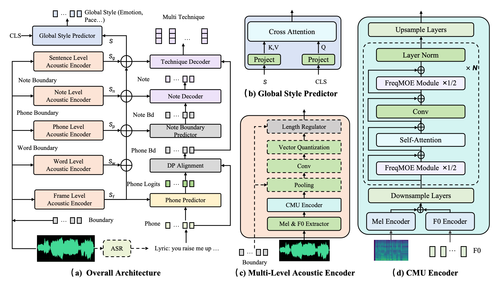
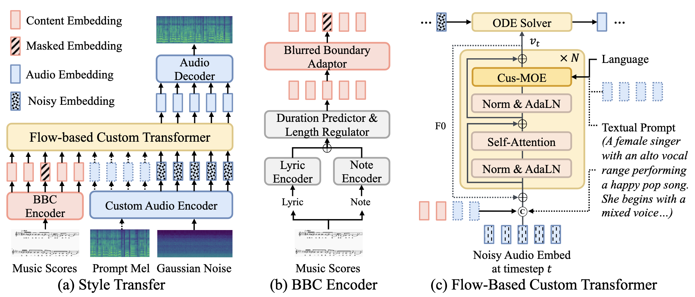
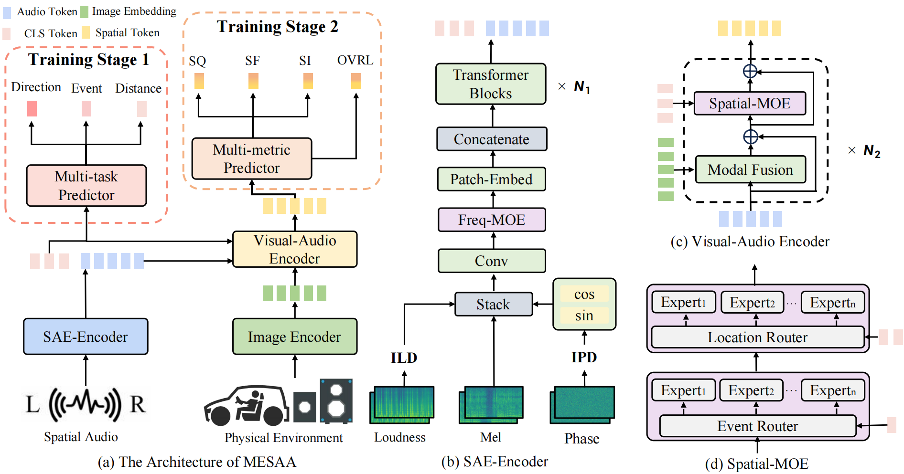
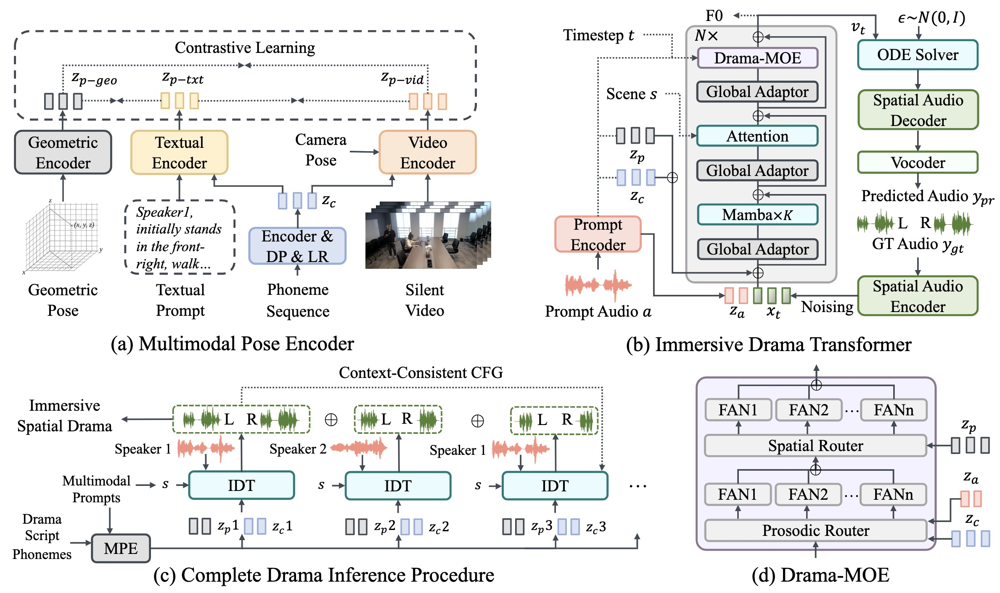
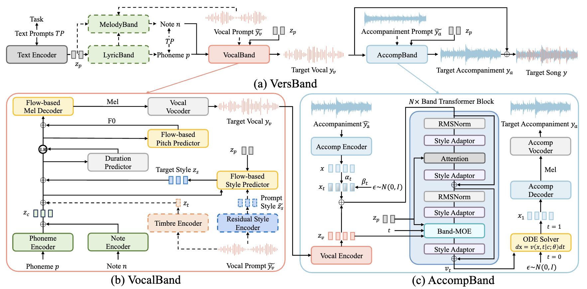
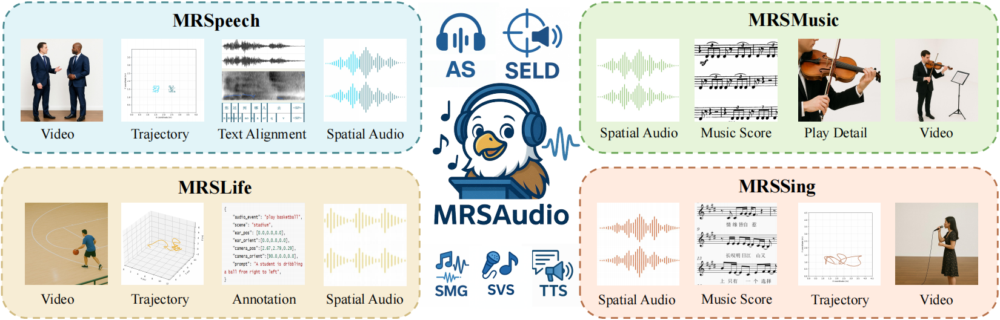

# 📝 Publications
*#* denotes co-first authors

## 🎙 Singing Voice Synthesis

    

        

            
NeurIPS 2024(Spotlight)

            

        

        

[GTSinger: A Global Multi-Technique Singing Corpus with Realistic Music Scores for All Singing Tasks](http://papers.nips.cc/paper_files/paper/2024/hash/023d2c1a17cf35b11a0cbb43a0677c91-Abstract-Datasets_and_Benchmarks_Track.html) \\
Yu Zhang, **Changhao Pan***#*, Wenxiang Guo*#*, et al.

  [**Demo**](https://gtsinger.github.io)

- GTSinger is a large Global, multi-Technique, free-to-use, high-quality singing corpus with realistic music scores, designed for all singing tasks.
- Our work is promoted by multiple media and forums, such as , , and .

    

        

            
ACL 2025(Findings)

            

        

        

[STARS: A Unified Framework for Singing Transcription, Alignment, and Refined Style Annotation]() \\
Wenxiang Guo#, Yu Zhang#, **Changhao Pan**#, et al.

[**Project**](https://demo-stars.github.io/)   
- STARS is a unified framework for singing transcription, alignment, and refined style annotation based on hierarchical representation learning.

    

        

            
ACL 2025(Findings)

            

        

        

[TCSinger 2: Customizable Multilingual Zero-shot Singing Voice Synthesis](https://arxiv.org/abs/2505.14910) \\
Yu Zhang#, Wenxiang Guo#, **Changhao Pan**#, et al.

[**Project**](https://aaronz345.github.io/TCSinger2Demo/) \|  
- TCSinger 2 is a multi-task multilingual zero-shot SVS model with style transfer and style control based on various prompts.

- `EMNLP-2024` [TCSinger: Zero-Shot Singing Voice Synthesis with Style Transfer and Multi-Level Style Control](https://arxiv.org/abs/2409.15977v2), Yu Zhang, Ziyue Jiang, Ruiqi Li, **Changhao Pan**, Jinzheng He, Rongjie Huang, Chuxin Wang, Zhou Zhao.

- `AAAI-2025` [TechSinger: Technique Controllable Multilingual Singing Voice Synthesis via Flow Matching](), Wenxiang Guo, Yu Zhang, **Changhao Pan**, et. al. 

## 👂 Spatial Audio

    

        

            
ACM-MM 2025

            

        

        

[A Multimodal Evaluation Framework for Spatial Audio Playback Systems: From Localization to Listener Preference]() \\
**Changhao Pan**#, Wenxiang Guo, Yu Zhang, et al.

 [**Project**](https://david-pigeon.github.io/mesa-demo/) 
- PSA-MOS provides 50 hours of high-quality spatial audio recordings, with detailed localization annotations and fine-grained MOS ratings.
- MESA is a multimodal evaluation framework for spatial audio playback systems which exhibits strong correlation with human perceptual assessments.

    

        

            
ACM-MM 2025

            

        

        

[ISDrama: Immersive Spatial Drama Generation through Multimodal Prompting](https://arxiv.org/abs/2504.20630) \\
Yu Zhang#, Wenxiang Guo#, **Changhao Pan**#, et al.

 [**Project**](https://aaronz345.github.io/ISDramaDemo/) 
- MRSDrama is the first multimodal recorded spatial drama dataset, containing binaural drama audios, scripts, videos, geometric poses, and textual prompts. 
- ISDrama is the first immersive spatial drama generation model through multimodal prompting.

## 🎼 Music Generation

    

        

            
Preprint

            

        

        

[Versatile Framework for Song Generation with Prompt-based Control](https://arxiv.org/abs/2504.19062) \\
Yu Zhang#, Wenxiang Guo#, **Changhao Pan**#, et al.

[**Project**](https://aaronz345.github.io/VersBandDemo/) 
- VersBand is a multi-task song generation framework for synthesizing high-quality, aligned songs with prompt-based control. 

    

        

            
Submitted to NeurIPS 2025

            

        

        

 \\
Wenxiang Guo*#*, **Changhao Pan***#*, Zhiyuan Zhu*#*, Xintong Hu*#*, et al.

 [**Demo**](https://mrsaudio.github.io/)

- The **largest recorded spatial audio dataset** contains four scenarios: daily life, singing, music, and speech, with a total duration of **500 hours**.
- Supports **multiple spatial audio tasks**: audio spatialization, spatial TTA, acoustic event localization and detection(SELD), etc.

## Others
- ``IEEE-TVCG`` [Interactive Table Synthesis with Natural Language](https://ieeexplore.ieee.org/document/10304286), Yanwei Huang, Yunfan Zhou, Ran Chen, **Changhao Pan**, Xinhuan Shu, Di Weng, Yingcai Wu.