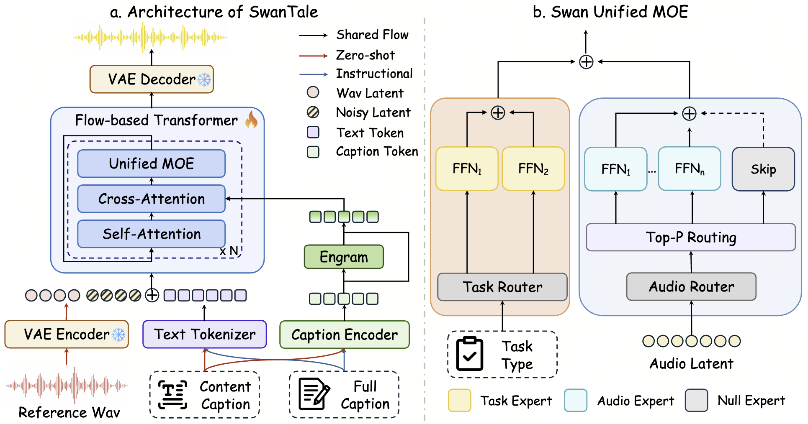
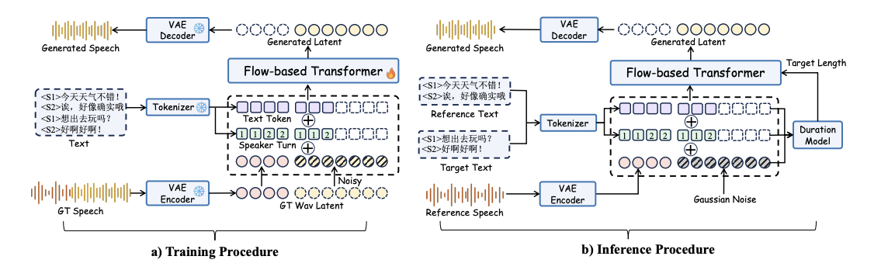
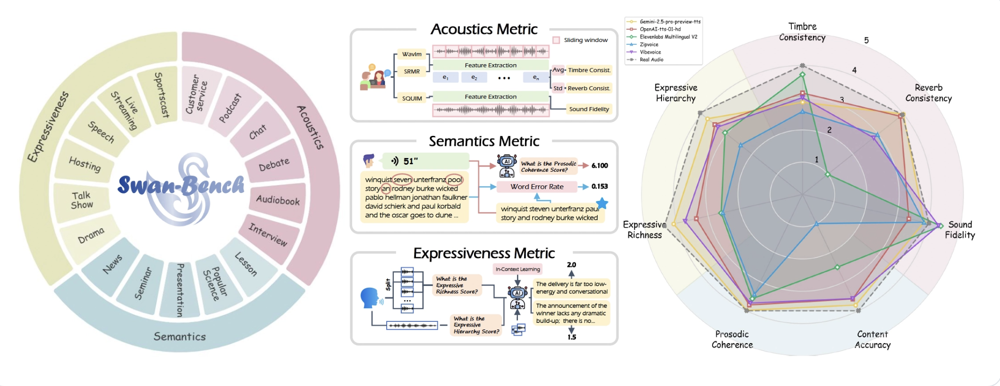
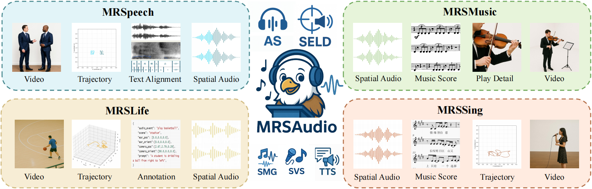
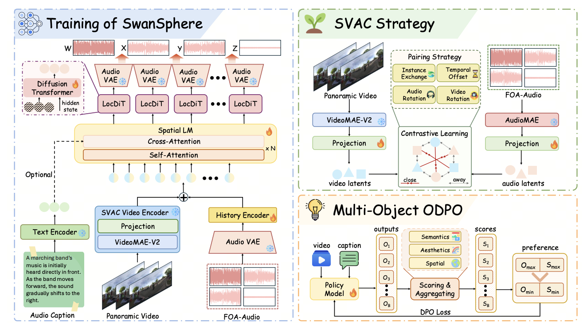
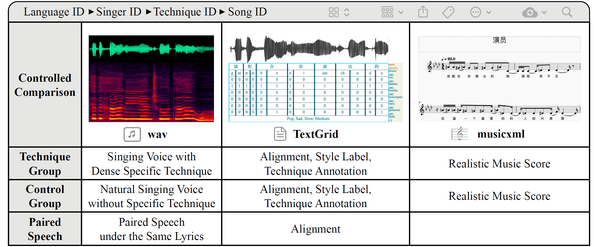
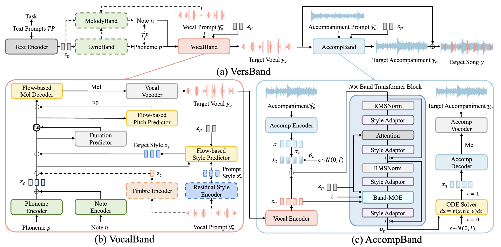

# 📝 Publications
*#* denotes co-first authors

## 🗣 Text-to-Speech

    

        

            
Technique Report

            

        

        

[SwanTale: Unified Multi-Speaker Speech and Audio Generation for Instruct and Zero-Shot Tasks](https://arxiv.org/abs/2608.02023) \\
Yu Zhang#, Ruiqi Li#, **Changhao Pan**#, et al.

[**Project**](https://swanaigc.github.io/#swantale) \| [**#1st of the Daily Paper**](https://huggingface.co/papers/2608.02023)

- SwanTale is a unified model for multi-speaker expressive speech and audio generation across instruct and zero-shot tasks.

    

        

            
Technique Report

            

        

        

[SwanVoice: Expressive Long-Form Zero-Shot Speech Synthesis for Both Monologue and Dialogue](https://arxiv.org/abs/2605.30993) \\
Ruiqi Li#, Yu Zhang#, **Changhao Pan**#, et al.

[**Project**](https://swanaigc.github.io/#swanvoice) \| [**#3rd of the Daily Pape**](https://huggingface.co/papers/2605.30993)

- SwanVoice is a zero-shot TTS model for expressive long-form monologue and dialogue with one to four speakers.

    

        

            
ACL 2026

            

        

        

[Comprehensive Benchmarking of Long-Form Speech Generation in Diverse Scenarios](https://arxiv.org/abs/2605.28618) \\
**Changhao Pan**, Rui Yang, Han Wang, et al.

[**Project**](https://swanaigc.github.io/#bench) \| 

- SwanBench-Speech evaluates long-form speech generation across scenario coverage, automatic metrics, and model behavior analysis.

- `Preprint` [Audio Editing in the Era of Foundation Models: A Survey](https://arxiv.org/abs/2606.23139), **Changhao Pan**, Yifei Fan, Fan Zhuo, Yifu Chen, Wenxiang Guo, Yu Zhang, et al. \| [**Project**](https://github.com/DaViD-Pigeon/AudioEditSurvey)

- `Preprint` [VoxAudio: Vocalized Audio Synthesis via Multi-Reward Autoregressive Flow Matching](https://arxiv.org/abs/2608.12951), Wenxiang Guo, **Changhao Pan**, Ziyue Jiang, Zhou Zhao, Fei Wu. \| [**Project**](https://voxaudio.github.io/)

- `ACL 2026` [Modeling and Benchmarking Spoken Dialogue Rewards with Modality and Colloquialness](https://arxiv.org/abs/2603.14889), Jingyu Lu, Yuhan Wang, Fan Zhuo, Xize Cheng, **Changhao Pan**, et al.

- `EMNLP 2026` [Speaking While Listening: A Survey and Empirical Audit of Full-Duplex Spoken Dialogue Systems](https://arxiv.org/abs/2606.19453), Jingyu Lu, Yuhan Wang, Jianming Luo, Yifu Chen, Tianle Liang, Shengpeng Ji, Ziyue Jiang, Xiaoda Yang, Yu Zhang, **Changhao Pan** et al. \| [**Project**](https://github.com/DuplexLM/DuplexSurvey)

## 👂 Spatial Audio

    

        

            
NeurIPS 2025

            

        

        

[MRSAudio: A Large-Scale Multimodal Recorded Spatial Audio Dataset with Refined Annotations]() \\
Wenxiang Guo*#*, **Changhao Pan***#*, Zhiyuan Zhu*#*, Xintong Hu*#*, et al.

 [**Demo**](https://mrsaudio.github.io/)

- The **largest recorded spatial audio dataset** contains four scenarios: daily life, singing, music, and speech, with a total duration of **500 hours**.
- Supports **multiple spatial audio tasks**: audio spatialization, spatial TTA, acoustic event localization and detection(SELD), etc.

    

        

            
ICML 2026

            

        

        

[Towards Streaming Synchronized Spatial Audio Generation via Autoregressive Diffusion Transformer](https://arxiv.org/abs/2605.30940) \\
Ke Lei#, Yu Zhang#, **Changhao Pan**#, et al.

[**Project**](https://swanaigc.github.io/#swansphere) \| 

- A causal autoregressive diffusion transformer architecture that enables streaming high-quality spatial audio generation.

- `ACM-MM-2025` [A Multimodal Evaluation Framework for Spatial Audio Playback Systems: From Localization to Listener Preference](https://dl.acm.org/doi/10.1145/3746027.3755571), **Changhao Pan**#, Wenxiang Guo#, Yu Zhang#, et al. \| [**Project**](https://david-pigeon.github.io/mesa-demo/)

- `ACMMM-2025` [ISDrama: Immersive Spatial Drama Generation through Multimodal Prompting](https://arxiv.org/abs/2504.20630), Yu Zhang#, Wenxiang Guo#, **Changhao Pan**#, et al. \|   [**Project**](https://aaronz345.github.io/ISDramaDemo/) 

- `EMNLP-2026` One-Stage Multi-Task Instruction-Guided 3D Spatial Audio Editing, Ke Lei, Chenyuhao Wen, Yu Zhang, Wenxiang Guo, **Changhao Pan**, et al.

- `EMNLP-2026` CSAVocoder: A Causal Spatial Audio Vocoder Towards Real-Time Spatial Audio Generation, Zhiyuan Zhu, Han Wang, Wenxiang Guo, Yu Zhang, **Changhao Pan**, et al.

- `AACL-IJCNLP-2025` [ASAudio: A Survey of Advanced Spatial Audio Research](https://arxiv.org/abs/2508.10924), Zhiyuan Zhu, Yu Zhang, Wenxiang Guo, **Changhao Pan**, Zhou Zhao. \| 

- `Preprint` [Spatial-Omni: Spatial Audio Understanding Integration in Multimodal LLMs via FOA Encoding](https://arxiv.org/abs/2606.10738), Zhiyuan Zhu, Yixuan Chen, Yiwen Shao, Wenxiang Guo, **Changhao Pan**, Yu Zhang, et al. \| 

## 🎙 Singing Voice Synthesis

    

        

            
NeurIPS 2024(Spotlight)

            

        

        

[GTSinger: A Global Multi-Technique Singing Corpus with Realistic Music Scores for All Singing Tasks](http://papers.nips.cc/paper_files/paper/2024/hash/023d2c1a17cf35b11a0cbb43a0677c91-Abstract-Datasets_and_Benchmarks_Track.html) \\
Yu Zhang, **Changhao Pan***#*, Wenxiang Guo*#*, et al.

  [**Demo**](https://aaronz345.github.io/GTSingerDemo/home)

- GTSinger is a large Global, multi-Technique, free-to-use, high-quality singing corpus with realistic music scores, designed for all singing tasks.
- Our work is promoted by multiple media and forums, such as , , and .

    

        

            
EMNLP 2025

            

        

        

[Versatile Framework for Song Generation with Prompt-based Control](https://arxiv.org/abs/2504.19062) \\
Yu Zhang#, Wenxiang Guo#, **Changhao Pan**#, et al.

 \|  [**Project**](https://aaronz345.github.io/VersBandDemo/)
- VersBand is a multi-task song generation framework for synthesizing high-quality, aligned songs with prompt-based control.

- `AACL-IJCNLP-2025(Oral)` [Synthetic Singers: A Review of Deep-Learning-based Singing Voice Synthesis Approaches](https://aclanthology.org/2025.ijcnlp-long.24/), **Changhao Pan**, Dongyu Yao, Yu Zhang, et al. \| 

- `ACL 2025(Findings)` [STARS: A Unified Framework for Singing Transcription, Alignment, and Refined Style Annotation](https://arxiv.org/pdf/2507.06670), Wenxiang Guo#, Yu Zhang#, **Changhao Pan**#, et al. \| [**Project**](https://gwx314.github.io/stars-demo/) \| 

- `ACL 2025(Findings)` [TCSinger 2: Customizable Multilingual Zero-shot Singing Voice Synthesis](https://arxiv.org/abs/2505.14910), Yu Zhang#, Wenxiang Guo#, **Changhao Pan**#, et al. \| [**Project**](https://aaronz345.github.io/TCSinger2Demo/) \| 

- `EMNLP-2024` [TCSinger: Zero-Shot Singing Voice Synthesis with Style Transfer and Multi-Level Style Control](https://arxiv.org/abs/2409.15977v2), Yu Zhang, Ziyue Jiang, Ruiqi Li, **Changhao Pan**, Jinzheng He, Rongjie Huang, Chuxin Wang, Zhou Zhao. ｜ [**Project**](https://aaronz345.github.io/TCSingerDemo/) \| 

- `AAAI-2025` [TechSinger: Technique Controllable Multilingual Singing Voice Synthesis via Flow Matching](), Wenxiang Guo, Yu Zhang, **Changhao Pan**, et. al.  \| [**Project**](https://gwx314.github.io/tech-singer/) \| 

## 📹 Audio-Visual Generation

- `Technical Report` [ALIVE: Animate Your World with Lifelike Audio-Video Generation](https://arxiv.org/abs/2602.08682), Ying Guo, Qijun Gan, Yifu Zhang, et al. \\
Contributor: **Changhao Pan**

- `ICML-2026` [TMD-Bench: A Multi-Level Evaluation Paradigm for Music-Dance Co-Generation](https://arxiv.org/abs/2605.01809v1), Xiaoda yang#, Majun Zhang#, **Changhao Pan**, et al.

- `Arxiv` [ImVideoEdit: Image-learning Video Editing via 2D Spatial Difference Attention Blocks](https://arxiv.org/abs/2604.07958), Jiayang Xu, Fan Zhuo, Majun Zhang, **Changhao Pan**, et al. 

## Others

- ``IEEE-TVCG`` [Interactive Table Synthesis with Natural Language](https://ieeexplore.ieee.org/document/10304286), Yanwei Huang, Yunfan Zhou, Ran Chen, **Changhao Pan**, Xinhuan Shu, Di Weng, Yingcai Wu.
